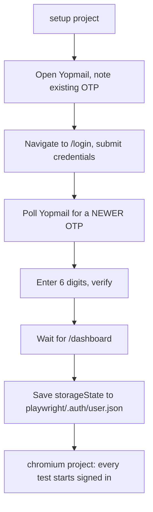

# TurnkeySR Admin — Playwright Automation

End-to-end UI test suite for the **TurnkeySR Strategic Relations admin portal**
(`admin.dev.turnkeysr.ai`), built with Playwright and TypeScript.

The suite logs in once per run — including the real email OTP round trip —
saves the session, and reuses it across every test. Page objects follow a
strict Page Object Model. Data-heavy screens export to CSV.

---

## Contents

- [Tech stack](#tech-stack)
- [Quick start](#quick-start)
- [Environment variables](#environment-variables)
- [Running tests](#running-tests)
- [Project structure](#project-structure)
- [Architecture](#architecture)
- [Reporting](#reporting)
- [CSV exports](#csv-exports)
- [Continuous integration](#continuous-integration)
- [Adding a test](#adding-a-test)
- [Troubleshooting](#troubleshooting)
- [Known gaps](#known-gaps)
- [Security notes](#security-notes)

---

## Tech stack

| Tool | Version | Role |
|---|---|---|
| [Playwright Test](https://playwright.dev) | ^1.62 | Runner and browser automation |
| TypeScript | via Playwright's transpiler | Test and page-object language |
| [dotenv](https://github.com/motdotla/dotenv) | ^17.4 | Loads `.env` |
| [allure-playwright](https://allurereport.org) | ^3.10 | Rich reporting with history |
| allure-commandline | ^2.43 | Generates and serves the Allure report |

Requires **Node 18+** (CI runs 24) and **Java 8+** for the Allure CLI only.

---

## Quick start

```bash
npm ci
npx playwright install chromium

cp .env.example .env      # then fill in real values
npm test
```

The first run logs in for real: it drives the login form, reads the one-time
password from a Yopmail inbox, verifies it, and writes the session to
`playwright/.auth/user.json`. Everything afterwards reuses that file.

---

## Environment variables

Copy `.env.example` to `.env`. **All five are required** — a missing one fails
immediately with a message naming it, rather than surfacing as a mysterious
login timeout thirty seconds in.

| Variable | Example | Purpose |
|---|---|---|
| `TSR_BASE_URL` | `https://admin.dev.turnkeysr.ai` | App under test. Becomes Playwright's `baseURL`, so page objects navigate with relative paths like `/login` |
| `TSR_EMAIL` | `bansari.p@yopmail.com` | Test account. **Must be a Yopmail address** — the mailbox name is derived from the part before the `@` |
| `TSR_PASSWORD` | `••••••••` | Test account password |
| `TSR_USER_NAME` | `Bansari` | Name the dashboard greets the account with (`Welcome, <name>!`) |
| `YOPMAIL_URL` | `https://yopmail.com/en/` | Where the OTP is read from. A separate origin, so it cannot ride on `TSR_BASE_URL` |

`.env` is gitignored. `.env.example` is committed and contains placeholders only.

---

## Running tests

| Command | Runs |
|---|---|
| `npm test` | Every UI test (Chromium) |
| `npm run test:smoke` | `tests/smoke` — dashboard, login, navigation |
| `npm run test:regression` | `tests/regression` — the CSV exports and TSR Users |
| `npm run test:headed` | Full UI suite with visible browsers |

Narrower runs:

```bash
# one file
npx playwright test tests/regression/tsr-users.spec.ts

# one test by title
npm test -- -g "Verify Dashboard"

# step through it
npm test -- -g "Verify Dashboard" --debug

# one browser window at a time
npm test -- --workers=1
```

> **`--headed` and `--debug` change how tests display, not which ones run.**
> To narrow the selection, use a path or `-g`.

Note that **the `setup` project runs no matter what you filter to** — it is a
declared dependency of every other project. Even a single-test run performs one
login and consumes one OTP.

---

## Project structure

```
├── config/
│   └── env.ts                 # Loads and validates .env — single source of truth
├── fixtures/
│   └── test-fixtures.ts       # Extends Playwright's `test` with the page objects
├── pages/                     # Page Object Model — one class per screen
│   ├── DashboardPage.ts
│   ├── LoginPage.ts
│   ├── NavigationPage.ts
│   ├── NonAcceptingUsersPage.ts
│   ├── OtpPage.ts
│   ├── TsrUsersPage.ts
│   └── YopmailPage.ts
├── setup/
│   └── auth.setup.ts          # Logs in once, saves storageState
├── tests/
│   ├── smoke/                 # Fast critical-path checks
│   └── regression/            # Data-heavy walks and exports
├── utils/
│   └── csv.ts                 # CSV writer with escaping and a UTF-8 BOM
├── auth-file.ts               # Path to the saved session, shared by config and setup
├── playwright.config.ts
└── scenarios.md               # Full scenario inventory and coverage report
```

**Why `auth-file.ts` exists as its own module**: `playwright.config.ts` needs
the session path, and so does `setup/auth.setup.ts`. Importing it *from* the
setup file would execute `setup(...)` while the config is being read, which
registers a test outside a test file and throws. A tiny shared module breaks
the cycle.

---

## Architecture

### Authentication — one login per run

The app stores its token in **`localStorage`**, not cookies. That single fact
shapes the whole design.



Consequences worth knowing:

- **`storageState` only replays localStorage into a page.** A test must navigate
  to the app's origin before it is authenticated — hence `dashboardPage.navigate()`
  at the top of most tests.
- **Tokens last 15 minutes**, so the session is rebuilt by `setup` on every run
  rather than cached between them.
- **`login.spec.ts` deliberately opts out** with
  `test.use({ storageState: { cookies: [], origins: [] } })`. It is the test that
  proves login works, so reusing a session would make it assert nothing.

### The OTP race

The Yopmail inbox is shared, and two logins can happen close together. Reading
"the latest email" is not enough — it may be a leftover code.

Every login therefore: **notes what is already in the mailbox → triggers the
login → polls until a code appears that differs from the noted one.** See
`YopmailPage.waitForNewOtp()`.

### Page Object Model

Every page object follows the same shape:

```ts
export class LoginPage {
  // Page
  readonly page: Page;

  // Locators
  readonly emailInput: Locator;
  readonly passwordInput: Locator;
  readonly signInButton: Locator;

  // Constructor
  constructor(page: Page) {
    this.page = page;
    this.emailInput = page.getByPlaceholder('Email');
    this.passwordInput = page.getByPlaceholder('Password');
    this.signInButton = page.getByRole('button', { name: 'Sign in' });
  }

  // Actions
  async login(email: string, password: string): Promise<void> { … }

  // Verification
  async verifyOtpRequested(): Promise<void> { … }
}
```

Rules the suite holds to:

| Rule | Why |
|---|---|
| Locators are `readonly` fields assigned in the constructor | Never built mid-test, so they read as a declaration of the page |
| Actions and verifications are separate methods | A `login()` that also asserts the redirect is doing two jobs |
| Tests contain **zero** locators | Selector churn touches `pages/` only |
| Page objects never import `config/` | `verifyDashboardLoaded(userName)` takes a parameter; the fixture supplies it |
| Prefer role and text over CSS | `getByRole`, `getByPlaceholder`, `getByText` survive restyling |
| Never use generated class names | `.MuiCard-root` is stable; `css-1qd26ta` is regenerated on every build |

### Fixtures

`fixtures/test-fixtures.ts` extends Playwright's `test`, so a spec declares only
what it needs:

```ts
test('Verify Dashboard', async ({ dashboardPage }) => { … });
```

Available: `loginPage`, `otpPage`, `dashboardPage`, `navigationPage`,
`nonAcceptingUsersPage`, `tsrUsersPage`, `yopmailPage`.

Fixtures are lazy — only the ones a test names are built. `yopmailPage` launches
its **own headless browser** rather than another context, because `headless` is
fixed when a browser launches and cannot be overridden per context. That keeps
the visible window on the app during headed runs, and keeps Yopmail's cookies
out of the saved session.

### Projects

| Project | testDir | Browser | Notes |
|---|---|---|---|
| `setup` | `./setup` | yes | Logs in, saves the session. Dependency of everything |
| `chromium` | `./tests` | yes | All UI tests |

Firefox and WebKit projects exist in the config but are **commented out** — so
every current pass means "passes in Chromium".

---

## Reporting

Three reporters run together:

| Reporter | Output |
|---|---|
| `list` | Per-test lines in the terminal, so a green run says what it ran |
| `html` | `playwright-report/` — traces, screenshots, failure context |
| `allure-playwright` | `allure-results/` — steps, attachments, history across runs |

```bash
npm run allure:serve      # generate and open in one step
npm run allure:generate   # write allure-report/
npm run allure:open       # open the generated report
npx playwright show-report
```

Traces are captured `on-first-retry`, and retries only happen on CI.

---

## CSV exports

Written to `output/csv/` (gitignored) by `utils/csv.ts`:

| File | Source | Columns |
|---|---|---|
| `non-accepting-users.csv` | Dashboard panel | Name, Role, Email, Company |
| `tsr-users.csv` | `/users` → TSR Users tab | Name, Role, Email |
| `tsr-users-non-accepting.csv` | `/users` → Non-accepting tab | Name, Role, Email |

The writer quotes only cells that need it — an unescaped comma in a company
name would silently shift every later column — and prefixes a UTF-8 BOM so
Excel does not mangle accented names.

Each export asserts its row count against the table's own
`1–10 of N` footer. Without that check, a pagination walk that stops on page 1
still looks like a pass.

---

## Continuous integration

`.github/workflows/playwright.yml`.

### Triggers

| Trigger | Behaviour |
|---|---|
| **Manual** (`workflow_dispatch`) | Actions tab → *Playwright CI* → **Run workflow**, with a dropdown to pick `all`, `smoke` or `regression` |
| **Push to `main` / `master`** | Runs the full suite, except when the push only touches `**.md`, `.gitignore` or `.env.example` |

Documentation commits are excluded on purpose: every run performs a real login
and consumes a one-time password from a shared mailbox, so a README typo
should not spend one.

Runs are also serialised with a `concurrency` group. Two runs at once would
race for the same inbox and could each pick up the other's code; the newer run
wins and the older is cancelled.

### What a run does

Installs dependencies, restores or installs Chromium, runs the chosen suite,
writes a results table to the run summary, and uploads `playwright-report/`
and `allure-results/` as artifacts. Every step after the tests uses
`if: always()`, so a red run still produces its evidence.

Caching covers both npm (via `setup-node`) and the Playwright browser
binaries, keyed on `package-lock.json`. On a cache hit the workflow still runs
`playwright install-deps`, because the OS libraries the browser links against
live outside the cached directory.

`retries` is **1** on CI rather than Playwright's usual 2 — a failure that
survives one retry is not flake, and the extra attempt mostly triples the wall
time of a genuinely broken suite.

### Required secrets — not configured yet

| Secret | Value |
|---|---|
| `TSR_BASE_URL` | `https://admin.dev.turnkeysr.ai` |
| `TSR_EMAIL` | The test account's Yopmail address |
| `TSR_PASSWORD` | The test account's password |
| `TSR_USER_NAME` | Name the dashboard greets it with |

Add them under **Settings → Secrets and variables → Actions**.

Until then the workflow runs but the suite stops immediately with:

```
Error: Missing required environment variable TSR_BASE_URL.
```

That is the intended behaviour. `config/env.ts` validates configuration at
load, so a missing secret fails in seconds with the variable's name rather
than surfacing as a login timeout thirty seconds into the run.

### Headless on CI

`playwright.config.ts` switches on `process.env.CI`:

```ts
headless: !!process.env.CI,
viewport: process.env.CI ? { width: 1920, height: 1080 } : null,
launchOptions: { args: process.env.CI ? [] : ['--start-maximized'] },
```

Local runs stay headed and maximised. CI runs headless — a GitHub runner has
no display, so a headed launch fails outright. The explicit viewport matters
just as much: `viewport: null` means "use the window size", and a headless
window is 800×600, which collapses the sidebar and breaks layout-dependent
locators.

---

## Adding a test

1. **Add or extend a page object** in `pages/`, following the template above.
2. **Register a fixture** in `fixtures/test-fixtures.ts` if it is a new page.
3. **Write the spec** in `tests/smoke/` or `tests/regression/` and tag it:

```ts
import { test, expect } from '../../fixtures/test-fixtures';

test('does the thing', { tag: ['@regression'] }, async ({ tsrUsersPage }) => {
  await tsrUsersPage.openTsrUsersTab();
  await tsrUsersPage.verifyCardHeading('TSR Users');
});
```

Folder decides which suite runs it; the tag mirrors the folder so `--grep` and
paths agree. Keep them in sync.

4. **Verify it compiles** without running anything:

```bash
npx playwright test --list
```

---

## Troubleshooting

| Symptom | Cause | Fix |
|---|---|---|
| `Missing required environment variable X` | `.env` absent or incomplete | `cp .env.example .env` and fill it in |
| Tests land on `/login` | Saved session stale or missing | Delete `playwright/.auth/user.json` and rerun; setup recreates it |
| `No OTP newer than … arrived in Yopmail` | Mail slow, or the code expired mid-debug | Rerun. OTPs last 15 minutes — stepping through with `--debug` can outlast one |
| `strict mode violation: resolved to 2 elements` | A locator matches more than one node | Scope it or use `exact: true`. `hasText` is a **case-insensitive substring** match — a frequent cause |
| Everything runs when you wanted one test | `--headed` / `--debug` do not filter | Use a path or `-g "title"` |
| Two browser windows open | The `yopmailPage` fixture launches its own | Expected. Only tests that read email request it |
| Allure CLI fails | Java missing | Install a JRE 8+ |

---

## Known gaps

**[`scenarios.md`](./scenarios.md)** holds the full inventory: **102 scenarios,
~19% automated**, each with priority, status and blockers.

The headline items:

- `tests/smoke/login.spec.ts` is currently **`test.skip`'d** — the critical path is untested
- Companies, TSR Chatbot and Help have **no coverage at all**
- Logout, session expiry and search are **unwritten despite the page-object methods existing**
- Console-error and failed-request listeners would add cross-cutting coverage to every existing test for almost no runtime
- Destructive flows (Add / Edit / Delete / Resend Invite) are catalogued but **not automated** — they mutate shared dev data and send real email

---

## Security notes

- **`.env` is gitignored** and must stay that way. `.env.example` holds placeholders only.
- **`playwright/.auth/user.json` is a live session.** Anyone holding it is signed in as that admin — no password, no OTP. Already covered by `.gitignore`.
- **Traces can contain the session token.** The app sends it on every request it makes, so it appears in the network entries a trace records. Traces are captured on retry, and retries only happen on CI — which is exactly where artifacts get published. Worth knowing before making those artifacts public.
- **The test mailbox is public.** Anyone can open the Yopmail inbox for the test account and read its OTPs. Treat the account as untrusted and never reuse the password elsewhere.
- **Never hardcode a JWT.** Tokens live 15 minutes; the suite reads a fresh one from the saved session on every run.
